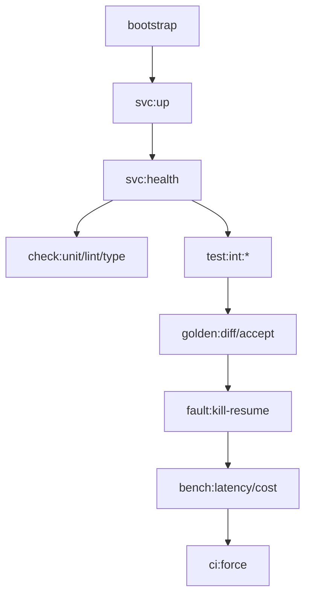

# ADR 001: Orchestration & Durability (Forkloom Core)

**Status:** Accepted | **Date:** 2026-02-27

## Context & Constraints
*   **Heterogeneous Stack:** Node 24, Python 3.12, UV, Postgres, SeaweedFS (S3).
*   **Constraint C1/C2:** Orchestration must stay `mise`-only. Secrets restricted to `fnox` bootstrap; strictly no `.env*` files in repo.
*   **Constraint C3/C4:** Repro locked via `mise.lock`. Fast deps requirement (`MISE_EXPERIMENTAL=1`).
*   **Target:** 100% deterministic CI + crash-resilient workflows.

## Decisions

### D1: `mise`-Centric Task DAG
Raw shell/npm scripts deprecated in favor of `mise-tasks`.
*   **Rationale:** Authoritative DAG metadata via `sources`/`outputs` prevents redundant SDK/logic re-runs.
*   **Shared Primitives:** Common shell concerns (assertions, logging) centralized in `scripts/lib/common.sh` (`R1`).
*   **Implication:** Sequential CI execution (`ci:force`) to ensure phase-wise gate integrity.

### D2: Secret Gating & Bootstrap
Global environment parsing blocked for required secrets.
*   **Pattern:** Logic hydrates via `bootstrap:secrets`. 
*   **Constraint:** `.env` is banned. Secret hygiene enforced in `doctor/secrets`.

### D3: Resilient Workflow Logic (Durability)
Core logic extraction into pure TS modules (`src/harness/`).
*   **Durability Pattern:** SQL-based idempotency (unique-idempotency) paired with DBOS-runtime crash/recovery simulations.
*   **Validation:** Real `runStep` checkpoint recovery checks in `test:int:dbos-runtime`.

### D4: Deterministic Artifact Contracts
OCR and AI/PI RPC gates use deterministic contracts.
*   **Implementation:** OCR post-process contract (Markdown/JSON/Spans/Hash).
*   **PI RPC:** Local OpenAI-compatible mock by default (`D7`); live bridge for gate validation.

---

## Technical Walkthrough

### 1. Task Orchestration DAG


### 2. Durability Pattern (Snippet)
Logic modules must follow the atomic `runStep` pattern for DBOS-ready recovery.

```typescript
// src/harness/logic.ts (Conceptual)
export async function processArtifact(data: RawData): Promise<Result> {
  // 1. Pure transformation
  const clean = canonicalize(data);
  
  // 2. Idempotent commit (SQL-backed)
  // Logic MUST handle 'already processed' via unique constraint
  const record = await db.insert(clean).onConflictDoNothing();
  
  return record;
}
```

### 3. SeaweedFS Root Health Check (C6)
S3 root returns 403 under auth. Health probes must check reachability, not status code.
```bash
# mise-tasks/svc/health snippet
curl -sS "${S3_URL}" > /dev/null || exit 1
```

## Implications
*   **Expert User Only:** Requires familiarity with `mise` task runners and `fnox` secret management.
*   **Local Env:** Requires Docker for `svc:up` (Postgres + SeaweedFS) to pass `test:int`.
*   **CI Reliability:** Sequential phases in `ci:force` prevent race conditions in heavy integration tests.
