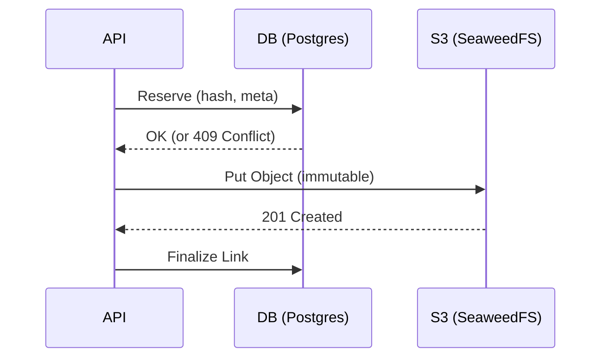

# ADR 002: Policy Enforcement & Compounding (Doctrine v2)

**Status:** Accepted | **Date:** 2026-02-27

## Doctrine (Hard Invariants)

1.  **Compounding (Lesson-Guard):** Every incident, bug, or PR **must** yield an invariant rule (`.codex/rules/*.md`) or a test update. `check:lesson-guard` enforces this. No "fix-only" PRs.
2.  **CAS Immutability:** Artifacts are immutable by exact-byte hash. Overwrites (409) are forbidden. Metadata links can update, but the object payload is final.
3.  **Strict TS Harness:** Mandatory `noUncheckedIndexedAccess` + `exactOptionalPropertyTypes`. Logic remains in `src/**` (pure); adapters in `scripts/harness/**` (impure/IO).
4.  **Transport Realism (PI Gate):** PI verification **must** exercise the real RPC protocol (OpenAI-compatible) to catch steering/state regressions. Local mocks are for CI speed, but `PI_RPC_STRICT_REAL=1` is the gate of truth.
5.  **Sequential CI Force:** `ci:force` is a sequential list of forced phases (`check` -> `test:int` -> `golden` -> `fault` -> `bench`). Parallel execution of gates is a policy violation to prevent false-green shadowing.

---

## Technical Architecture

### 1. Artifact CAS Contract (C8/D23)
Artifacts are reserved in SQL before being written to S3. This "reserve-first" pattern ensures unique-idempotency.



### 2. TS Harness Separation (10-ts-harness)
Logic is decoupled from IO to ensure 100% deterministic unit testing of core transformations.

*   `src/**`: Pure functions, explicit types, zero side-effects.
*   `scripts/harness/**`: Adapters, env hydration, CLI parsing, artifact emission.

### 3. Living-Spec Enforcement (`check:lesson-guard`)
A custom gate that diffs the current branch against the target. If code changes exist without a corresponding change in `AGENTS.md`, `.codex/rules/`, or `tests/`, the build breaks.

```bash
# mise-tasks/check/lesson-guard snippet
if git diff --name-only HEAD | grep -vE "^(AGENTS.md|.codex/rules/|tests/)"; then
  git diff --name-only HEAD | grep -E "^(AGENTS.md|.codex/rules/|tests/)" || exit 1
fi
```

---

## Implementation Walkthroughs

### 1. Sequential CI Force Chain
Single-shot multi-arg `mise run` commands can fail silently or skip tasks. The `ci:force` task explicitly chains gates to ensure total coverage.

```toml
# .mise.toml
[tasks."ci:force"]
depends = ["check", "test:int", "golden", "fault", "bench"]
# Sequential enforcement via internal task deps or sequential execution script
```

### 2. Reset Policy (`svc:reset`)
`svc:reset` is a destructive operation that must clear all state, including root-owned `.data/seaweed` and stale probes in `/tmp`.

```bash
# scripts/lib/common.sh reset logic
rm -rf .cache/ .tmp/ .data/seaweed/
# Fallback for root-owned volumes
docker run --rm -v $(pwd):/v alpine rm -rf /v/.data/seaweed
```

---

## Guidelines for Experts
*   **Artifact Meta:** Keys must be namespaced lowercase (e.g., `forkloom:ocr-version`). Invalid keys are rejected at the HTTP boundary.
*   **Durability Proof:** A task is not complete without a SQL unique-idempotency check AND a DBOS-runtime crash simulation.
*   **Docs Drift:** README command blocks are considered code. If they don't execute against the current CLI, it's a build breakage.

## References
*   `docs/adr/001-core-orchestration-and-durability-patterns.md`
*   `.codex/rules/*.md` (Modular Invariants)
