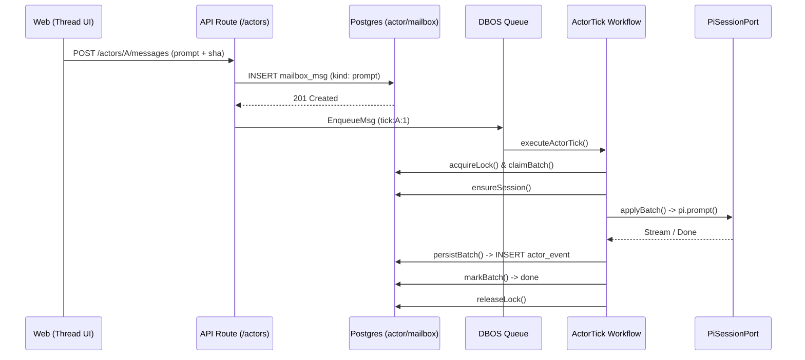

# ADR 004 Supplemental Assets

## Tick Runtime Diagram

## Data Model Invariants

- **`actor`**: Stores `mailbox_cursor` and `status`. Only mutated during event projections inside the DBOS step.
- **`mailbox_msg`**: Guards `UNIQUE(actor_id, seq)` and `UNIQUE(actor_id, dedupe_key)`. State transitions: `pending -> claimed -> done/failed`.
- **`actor_lock`**: Ensures only one active DBOS workflow per actor. Uses `expired_at` for lease semantics.
- **`actor_event`**: Append-only log. The ultimate truth for UI reducers (`seq`, `kind`, `payload`).
