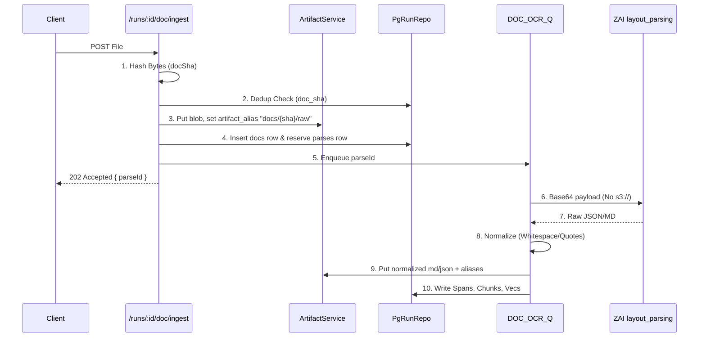

# ADR 007: Doc Ingest, OCR, and Retrieval Pipeline (C5)

**Status:** Accepted
**Date:** 2026-03-02
**Context:** Spec 07 (C5) Implementation - Deterministic, DBOS-orchestrated, and cite-first document intelligence.

## 1. Doctrine & Constraints

**Absolute Rules:**
1.  **No Side Infra:** Reuse Postgres (`docs`, `parses`, `chunks`, `spans`, `chunk_vec`), SeaweedFS (`cas/`), and `apps/api` DBOS orchestrator. No vector DB sidecars. No separate ingestion worker processes.
2.  **ID Law & Hash Determinism:** Normalize BEFORE hashing. `parseId` must encode `docSha`, `parserVer`, `cfgHash`, and `normVer`. Ad-hoc hash assembly is a regression.
3.  **Namespace over CAS:** One storage substrate (`ArtifactService`). Files (`raw`, `md`, `json`) exist as immutable blobs in `cas/`. `artifact_alias` maps semantic keys (e.g., `docs/{sha}/parses/{id}/md`) to CAS blobs.
4.  **ZAI Bytes Law:** ZAI `layout_parsing` receives `data:image/png;base64` or `data:application/pdf;base64`. Do NOT leak internal `s3://` URIs to external APIs.
5.  **Zero `innerHTML`:** Web rendering must use strictly typed text nodes/React primitives. XSS safety is structural.
6.  **Hard Ops Gates:** Code changes without accompanying test/rule deltas fail `check:lesson-guard`. Merges demand non-vacuous SQL checklists + golden replay proofs.

## 2. ID Law & Core Schema

Centralize hash generators. All structural nodes depend on precisely calculated IDs.

```typescript
// ID Law Enforced
const docSha = hashBytes(rawBuffer);
const parseId = hashString(`${docSha}|${parserVer}|${cfgHash}|${normVer}`);
const chunkId = hashString(`${parseId}|${blockIdx}|${chunkIdx}`);
const spanId = hashString(`${parseId}|${pageIdx}|${spanIdx}`);
```

### Table Topology

*   `docs`: `sha` (PK), `mime`, `size_bytes`, `status`.
*   `parses`: `parse_id` (PK), `doc_sha`, `status`, `billable_pages`.
*   `spans`: `span_id` (PK), `parse_id`, `page_idx`, `bbox`, `text`.
*   `chunks`: `chunk_id` (PK), `parse_id`, `text`, `prev_id`, `next_id`, `parent_id`.
*   `chunk_vec`: `chunk_id` (PK), `emb` (`vector(768)`).

*See `007-doc-ingest-and-retrieval/schema.sql` for the full DDL.*

## 3. Ingest & OCR Pipeline Workflow

DBOS orchestrated queue (`DOC_OCR_Q`). Idempotency is enforced at the workflow level.



### Normalization Law
Before saving `md` and `json`, normalize outputs. A single stray whitespace diff breaks hash determinism and replay validity.

## 4. Chunking & Indexing Strategy

Chunks are not arbitrary string splits. They are semantic tree cuts (tables, formulas, headings) derived from `layout_details`.

*   **Atomic Entities:** Tables and formulas must not be split mid-element.
*   **Adjacency Graph:** `prev_id`, `next_id`, `parent_id` maintain document reading order and hierarchy.
*   **Dual Indexing:** Lexical `tsvector` + Semantic `pgvector` (`cosine` distance).

## 5. Retrieval & Resolve Contract

All hits must be verifiable. **Cite-first** is mandatory.

### Search Route (`POST /runs/:id/doc/search`)
Merges FTS and Vector search.

```json
{
  "hits": [
    {
      "chunkId": "...",
      "score": 0.94,
      "text": "...",
      "spans": [{"spanId": "...", "pageIdx": 2, "bbox": [...]}]
    }
  ]
}
```

### Resolve Route (`POST /runs/:id/doc/resolve`)
Given a `spanId`, returns the exact markdown slice and bounding box details.

*See `007-doc-ingest-and-retrieval/api-contracts.ts` for route specifications.*

## 6. Verification, Ops & Fault Drills

Synthetic testing is banned. We demand real DBOS recovery paths and empirical proofs.

### Nasty Corpus Gate
A hard gate against a fixed set of 10 edge-case documents (rotated scans, complex tables, obscure encodings). The pipeline must extract and index these accurately or CI fails.

### Crash Drills (`fault:doc-kill-resume`)
1. Start live ingestion.
2. `SIGKILL` the `apps/api` process midway (e.g., inside the OCR step).
3. Restart `apps/api`.
4. Assert: Process resumes. ZERO duplicated blobs. ZERO duplicate spans/chunks. Hashes match the golden ledger perfectly.

### Non-Vacuous Ops SQL
Ops tests (`test:int:ops-sql`) must run real SQL to assert completeness. E.g., verifying tasks ledger is complete.

```sql
-- Ensure all pipelines actually generated vector rows
SELECT count(*) FROM chunks c 
LEFT JOIN chunk_vec v ON c.chunk_id = v.chunk_id 
WHERE v.chunk_id IS NULL; -- MUST be 0
```
