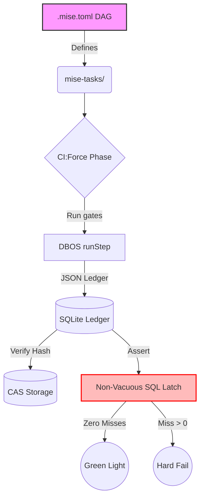

# ADR 009: HTN Doctrine, Orchestration & Bounded State

**Date:** 2026-03-03
**Status:** Enforced
**Scope:** Core Architecture, Orchestration, Validation, State Management

## 1. Context & Scope
Derived from `@spec-0` (`00-learnings`, `09-htn`, `09-tasks`, `09-tutorial`), this ADR crystallizes the **Hierarchical Task Network (HTN)** and **Tacit Knowledge** into non-negotiable architectural law. The system demands extreme determinism, zero drift, and replayable durability.

## 2. Core Decisions & Law

### 2.1. Orchestration: DAG is Absolute
- **Law:** `mise`+`fnox` ONLY. NO `make`, NO `npm scripts`, NO `.env`.
- **DAG Supremacy:** `.mise.toml` is the sole source of execution truth. A lane not in the DAG is operationally non-existent (Tacit `T810`). Non-exec scripts live in `mise-tasks/`.
- **Sequential Force:** `ci:force` runs phases sequentially, never in parallel, to ensure deterministic phase transitions (Decision `D6`).

### 2.2. Public Edge & The Slot Ecosystem
- **Law:** `C7-01` Wire stays run-owned. Top-level API endpoints (`/extensions`, `/packages`, `/themes`) are BANNED. The public surface is exactly `/runs/:id/*`.
- **API Floor:** `C7-02` Extension API floor is permanently frozen (`registerTool`, `registerCommand`, `registerProvider`, `appendEntry`, `on`, `hasUI`, `ui`).
- **Flagships as Packages:** `C7-15` Flagship tools (WILL-RUN, widget, wizard) ship as standard extensions. Zero core special-casing.

### 2.3. Durability, Determinism & Package Loading
- **Law:** `C7-03` Reload is transactional (`unloadAll` -> `clearRegistries` -> `loadDiscovered` with rollback).
- **Identity & Merge:** `C7-07` Settings merge is strictly identity-based (project-wins) with deterministic deduplication/sorting. Order-dependent file merges are forbidden.
- **Resource Filters:** `C7-09` Filtering is declarative narrowing (`undefined`=all, `!`=exclude, `+`=include) evaluated at load time. NO runtime `if(flag)` branches.
- **Theme Contract:** `T510` Theme JSON is a strict contract. Missing tokens trigger hard failures, not silent fallbacks.

### 2.4. Non-Vacuous Verification (The SQL Latch)
- **Law:** `C7-20` The close latch MUST BE non-vacuous. `checklist` status + `proofMatrixOk` + zero missing requirements.
- **Bounded Polling:** `C7-19` Single-shot `curl` is banned. Must use bounded `wait_for_url` / health polling.
- **No Manual Overrides:** `C7-22` Manual edits to `ci-force` green marks are strictly forbidden. Failure artifacts are the absolute source of truth.

## 3. Walkthroughs & Procedural Knowledge

### 3.1. The Ext-State Envelope (Branch-Correct State)
**Tacit Rule `T640`:** Persistent extension state MUST be branch-correct session log entries. Local caches or side-DB channels destroy truth under branch navigation.

```ts
// GOOD: Append-only log for deterministic state recreation
await api.appendEntry({ type: 'ext-state', payload: { hydrated: true, id: '123' } });

// BAD: Writing to local disk or a side DB (FATAL: breaks under replay/branch navigation)
fs.writeFileSync('/tmp/ext-cache.json', JSON.stringify({ hydrated: true })); 
```

### 3.2. Transactional Extension Reload (`C7-03`)
```ts
// Rollback on fail prevents non-deterministic residue
const snapshot = createRegistrySnapshot();
try {
  await unloadAll();
  await clearRegistries();
  await loadDiscovered(config);
} catch (err) {
  await restorePreviousGraph(snapshot);
  throw new Error("Reload aborted. Prior graph restored.");
}
```

### 3.3. Non-Vacuous Gate Check (SQL Proof)
```sql
-- DCD07: Validate that ALL requirements are fully covered by implemented nodes
SELECT count(*) FROM req_cover WHERE fit != 'full';
-- Expect: 0. Any other result halts the deploy gate.

-- C7-20: Ensure latch is completely closed
SELECT * FROM node WHERE done != 'true';
-- Expect: 0 rows.
```

## 4. Execution Clusters (The C7 Wave Model)
Implementation is mapped to 4 explicit clusters covering `CY0` to `CY8`:
1. **`C-A` (CY0-CY2):** Wire freeze + extension runtime core. Establishes public law and Extension runtime substrate.
2. **`C-B` (CY3-CY4):** Package core + resource graph/filter semantics. Startup hydration and settings merge.
3. **`C-C` (CY5-CY6):** Theme provider seams + Flagship extension delivery. Strict themes + branch-state restore.
4. **`C-D` (CY7-CY8):** SDK/stream integration + Non-vacuous gate closure. Final lattice tests and SQL evidence.

## 5. Diagrams

### 5.1. The HTN Replay & Durability Lattice

